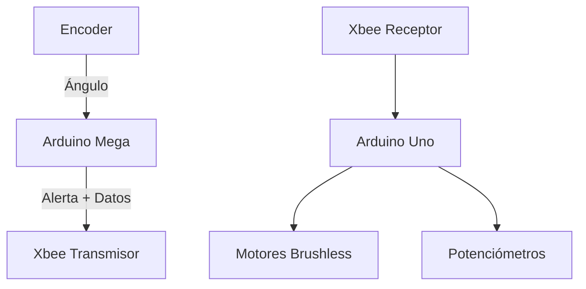

# 🎯 Sistema Embebido para Monitoreo y Control de un Banco de Pruebas

Este proyecto consiste en un sistema embebido diseñado para **monitorear y controlar un banco de pruebas**, prototipo de un sistema tipo *de control y potencia*. Utiliza dos placas Arduino (Mega y Uno) que se comunican mediante módulos Xbee para mantener el sistema operando dentro de límites seguros.

## 📋 Tabla de Contenido

- [🎯 Descripción del Proyecto](#-descripción-del-proyecto)
- [🛠️ Tecnologías Utilizadas](#️-tecnologías-utilizadas)
- [📡 Arquitectura del Sistema](#-arquitectura-del-sistema)
- [⚙️ Instalación y Configuración](#️-instalación-y-configuración)
- [🚀 Uso del Sistema](#-uso-del-sistema)
- [👨‍💻 Autores](#-autores)
- [📝 Licencia](#-licencia)

## 🎯 Descripción del Proyecto

El sistema está compuesto por dos Arduinos que colaboran de la siguiente manera:

- **Arduino Mega (Maestro)**:  
  Mide el ángulo del banco mediante un encoder ubicado en el eje principal.  
  Compara el valor con límites mínimo y máximo configurables desde el monitor serial.  
  Si el ángulo excede esos límites, se genera una alerta que es enviada mediante Xbee al Arduino esclavo.

- **Arduino Uno (Esclavo)**:  
  Recibe la alerta por comunicación serial Xbee.  
  Controla dos motores brushless con potenciómetros para ajustar su velocidad.  
  Si se recibe una alerta, los motores se detienen inmediatamente como medida de seguridad.  
  Para reactivar el sistema tras una alerta: reinicia el Arduino Uno.

## 🛠️ Tecnologías Utilizadas

- Arduino Mega 2560
- Arduino Uno
- Encoder rotatorio
- Módulos Xbee
- Motores Brushless
- Potenciómetros
- Lenguaje: C++ (Arduino)

## 📡 Arquitectura del Sistema

## ⚙️ Instalación y Configuración

1. Conecta los componentes según el diagrama electrónico.
2. Carga el código correspondiente en cada Arduino:
   - Mega: medición y alerta.
   - Uno: control de motores y recepción.
3. Configura los módulos Xbee con los mismos parámetros de red.
4. Abre el monitor serial del Mega para establecer los límites de ángulo.

## 🚀 Uso del Sistema

1. Enciende ambos Arduinos.
2. Ajusta los límites del ángulo desde el monitor serial del Arduino Mega.
3. Observa el comportamiento:
   - Si el ángulo se mantiene dentro del rango: los motores funcionan normalmente.
   - Si el ángulo se sale del rango: se detienen los motores.
4. Para restablecer el sistema tras una alerta: reinicia el Arduino Uno.

## 👨‍💻 Autores

- [Tu Nombre Aquí] – Desarrollador del sistema

## 📝 Licencia

Este proyecto está licenciado bajo la licencia MIT. Consulta el archivo [LICENSE](LICENSE) para más información.
