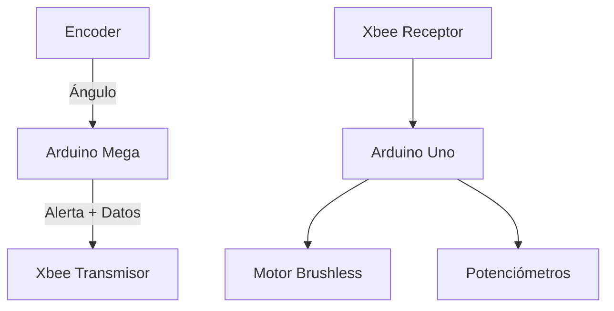

# Sistema Embebido para Monitoreo y Control de un Banco de Pruebas

Este proyecto consiste en un sistema embebido diseñado para **monitorear y controlar un banco de pruebas**, prototipo de un sistema tipo *de control y potencia*. Utiliza dos placas Arduino (Mega y Uno) que se comunican mediante módulos Xbee para mantener el sistema operando dentro de límites seguros.

## 📋 Tabla de Contenido

- [🎯 Descripción del Proyecto](#-descripción-del-proyecto)
- [🛠️ Tecnologías Utilizadas](#️-tecnologías-utilizadas)
- [📡 Arquitectura del Sistema](#-arquitectura-del-sistema)
- [⚙️ Instalación y Configuración](#️-instalación-y-configuración)
- [🚀 Uso del Sistema](#-uso-del-sistema)
- [📝 Licencia](#-licencia)

## 🎯 Descripción del Proyecto

El sistema está compuesto por dos Arduinos que colaboran de la siguiente manera:

- **Arduino Mega (Maestro)**:  
  Mide el ángulo del banco mediante un encoder ubicado en el eje principal.  
  Compara el valor con límites mínimo y máximo configurables desde el monitor serial.  
  Si el ángulo excede esos límites, se genera una alerta que es enviada mediante Xbee al Arduino esclavo.

- **Arduino Uno (Esclavo)**:  
  Recibe la alerta por comunicación serial Xbee.  
  Controla un motor brushless con potenciómetros para ajustar su velocidad.  
  Si se recibe una alerta, el motor se detienen inmediatamente como medida de seguridad.  
  Para reactivar el sistema tras una alerta: reinicia el Arduino Uno.

## 🛠️ Materiales necesarios para la practica

- 1 Tarjeta de desarrollo Arduino Uno “Potencia”.
- 1 Tarjeta de desarrollo Mega “Control”.
- 1 Adaptador para placa arduino xbee “Control”.
- 2 Motor brushless RS2205.
- 1 Encoder ACE-128.
- 2 Baterias Lipo.
- 2 Xbee PRO S2X.
- 2 Controlador electrónico de velocidad ESC.
- 2 potenciometros 10k.
- 8 resistencias 1k “encoder”.

## 📡 Arquitectura del Sistema

## Diagrama Electrónico

## Potencia

## Control

## ⚙️ Instalación y Configuración

1. Conecta los componentes según el diagrama electrónico.
2. Carga el código correspondiente en cada Arduino:
   - Mega: medición y alerta.
   - Uno: control de motor y recepción.
3. Configura los módulos Xbee con los mismos parámetros de red.
4. Abre el monitor serial del Mega para establecer los límites de ángulo.

## 🔧 Configuración de XBee con XCTU

Para establecer la comunicación entre los módulos XBee conectados al Arduino de **control** y al Arduino de **potencia**, es necesario configurarlos correctamente utilizando la herramienta **XCTU**.

### 1. Selección de puertos

Abre XCTU y selecciona los puertos donde están conectados los módulos XBee.

---

### 2. Análisis de dispositivos XBee

Haz clic en el ícono de lupa para escanear los dispositivos XBee conectados y verificar su disponibilidad.

---

### 3. Configuración del Coordinador

Configura uno de los módulos XBee como **coordinador** con los siguientes parámetros:

- **Protocolo**: 802.15.4  
- **PAN ID**: `1001`  
- **Coordinador Enable**: `Coordinator`

---

### 4. Configuración del Nodo Remoto

El segundo módulo XBee debe configurarse como **dispositivo final** con los siguientes parámetros:

- **Protocolo**: 802.15.4  
- **PAN ID**: `1001`  
- **Coordinador Enable**: `End Device`

---

### 5. Pruebas de comunicación por terminal

#### 🧪 Prueba terminal del Coordinador

Envía datos desde el coordinador y verifica la respuesta del nodo remoto.

#### 🧪 Prueba terminal del Nodo Remoto

Envía datos desde el nodo remoto y verifica la recepción en el coordinador.

## 🚀 Uso del Sistema

1. Enciende ambos Arduinos.
2. Ajusta los límites del ángulo desde el monitor serial del Arduino Mega.
3. Observa el comportamiento:
   - Si el ángulo se mantiene dentro del rango: el motor funcionan normalmente.
   - Si el ángulo se sale del rango: se detiene el motor.
4. Para restablecer el sistema tras una alerta: reinicia el Arduino Uno.

## Trabajo futuro desarrollar gemelo digital

